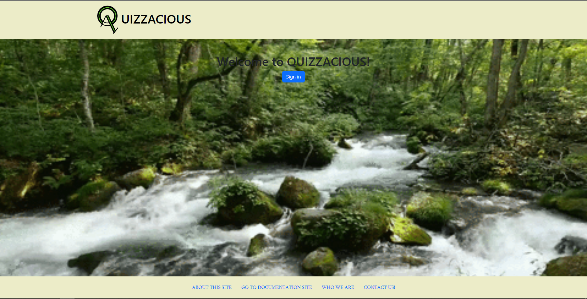
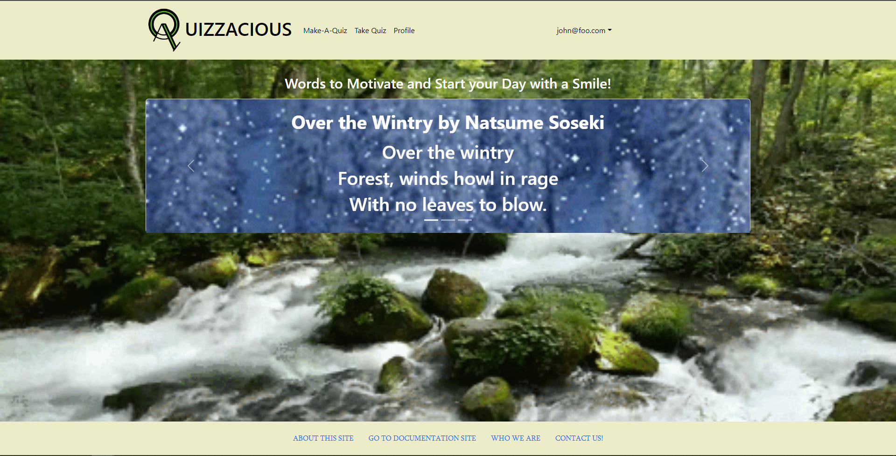
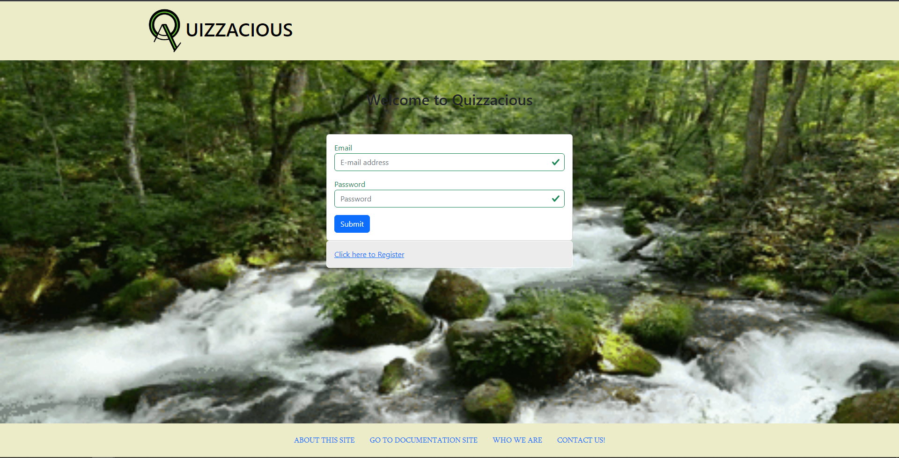
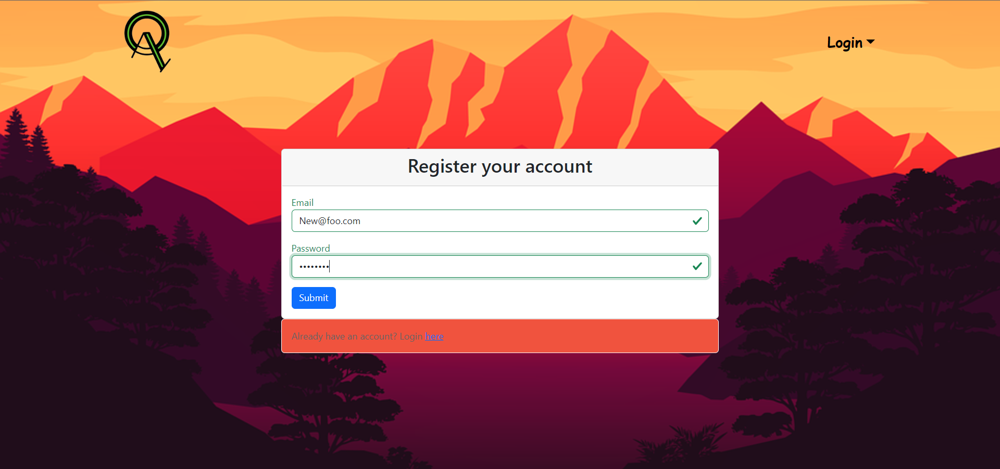
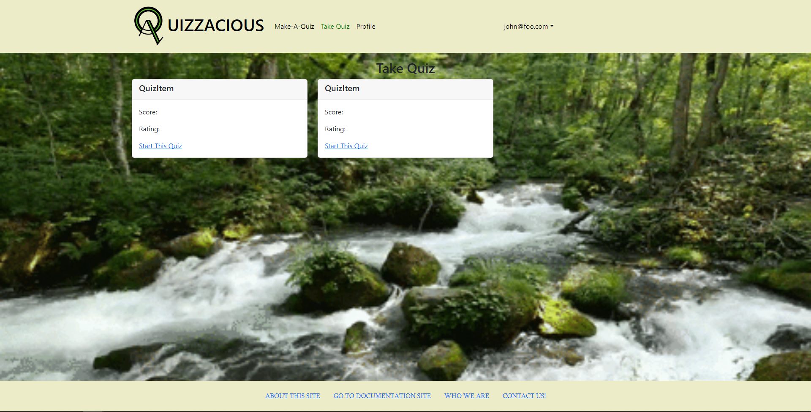
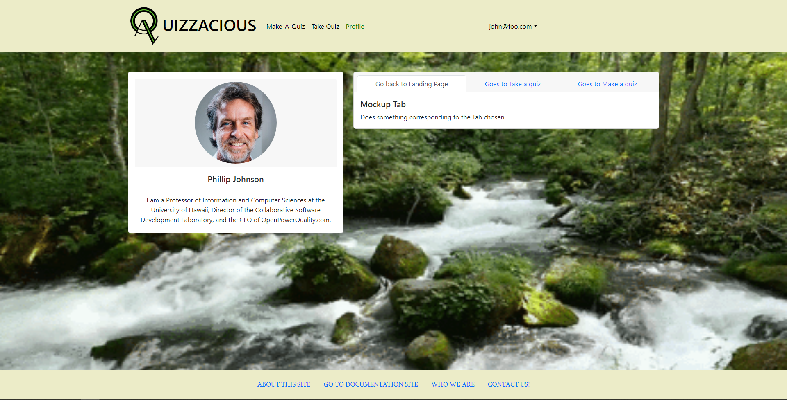
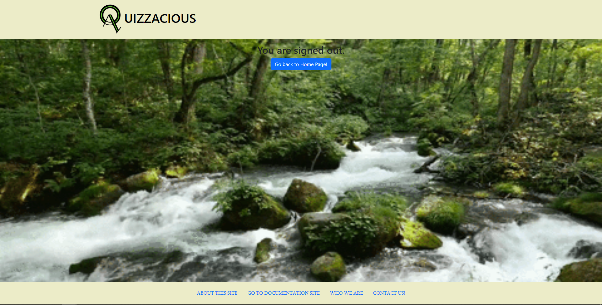
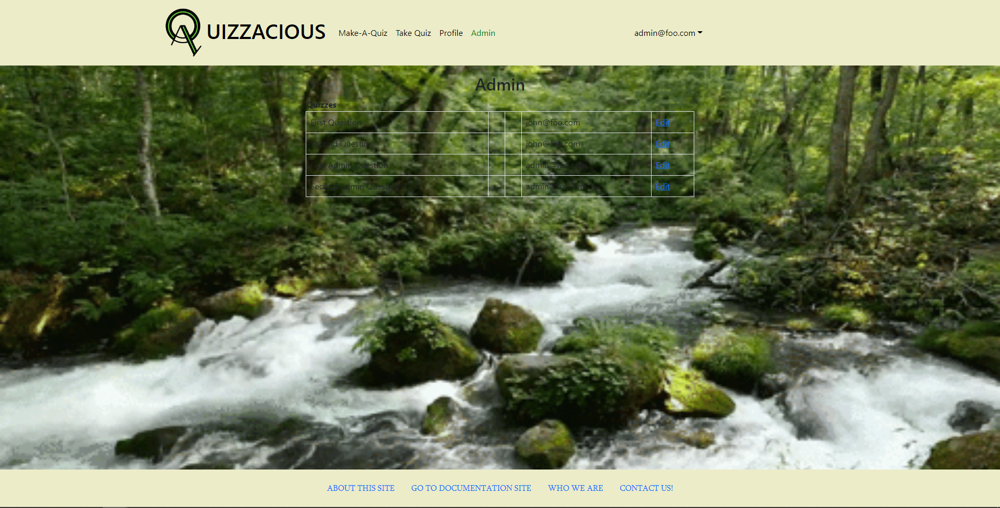

# Quizzacious

## Overview

Quizzacious is a program/app that allows students to make and organize quizzes and also send them to each other.

## Deployment
[See our program here](http://164.92.109.35/intro)

## User Guide
### Landing Page(Intro Page/Landing Page)
This introduction page is meant for user to act as a first landing page before any login-ins are done.
This also what the users see when they visit the site using the URL from above and this does not have navbar items.

This page is meant to act as home page after successful authentication and/or login. 
The navbar have items available for users to interact with and dropdown button with user email will appear with signout button.

### Sign In/Register
Quizzacious allows users to enter their site credentials such as their username and password that is if they have such an account.

Allows the users to register and create a new account with the following fields email and passwords that want to use.

### Make Quiz

### Take Quiz
This allows the users to take their own quizzes with certain fields tied to item that they created in Make-A-Quiz section. It has the following fields such as Quiz Name, Score, Rating, and eventually a start-this-quiz.

### Profile
User can see their profile that they set from the registration page and it also allows users to go through other multiple tabs such as achievements, ratings, and scores(Not implemented just yet!).

## Sign Out
User can sign out from the navbar dropdown and it will also have go back to Home Page button that will take the user back to intro page.

## Admin

## Development History
### M1
[Milestone 1 Project](https://github.com/orgs/quizzacious/projects/1)
### M2
[Milestone 2 Project](https://github.com/orgs/quizzacious/projects/2)

## Contact Us
[Our Organization](https://github.com/quizzacious)
[Team Contract](https://docs.google.com/document/d/1odUst7-lIJJlnpdIlA9A50tL59SpUqIhHPayiyPgL-k/edit?usp=sharing)
