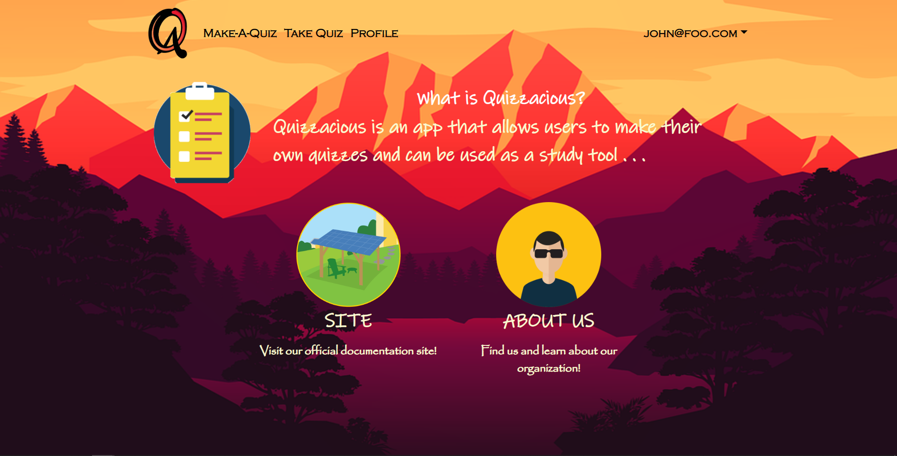
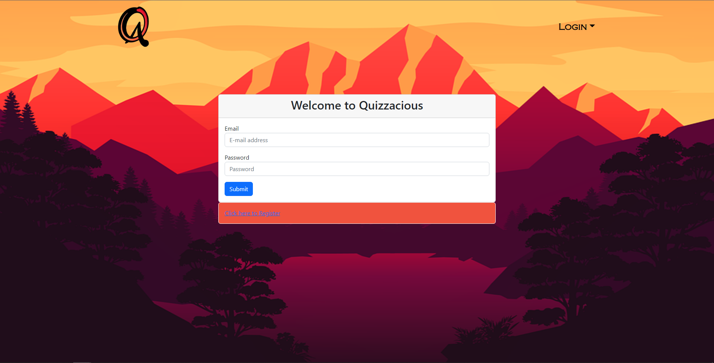
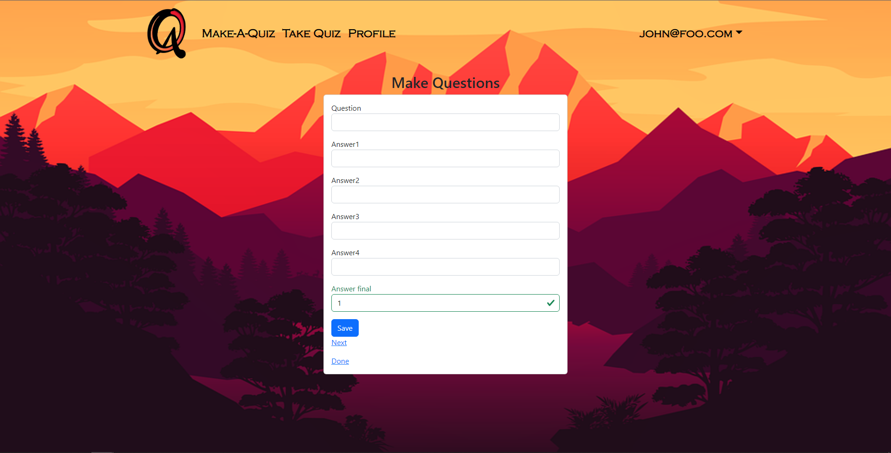
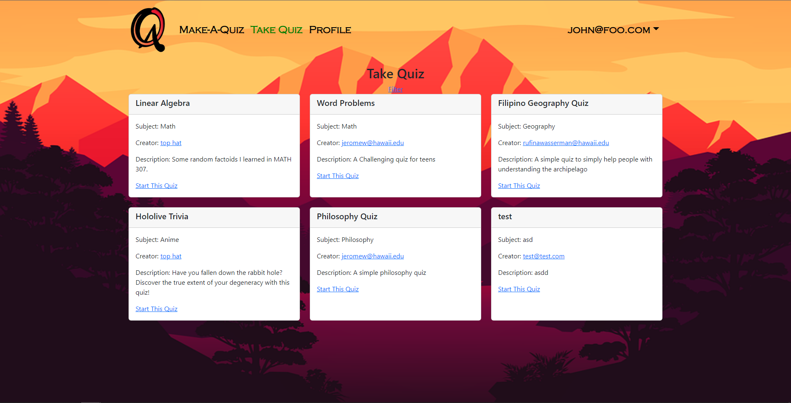
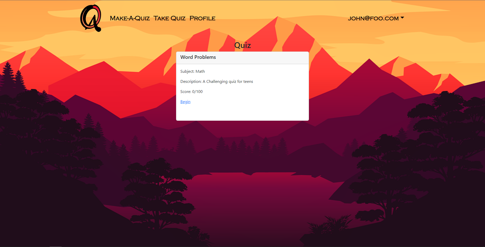
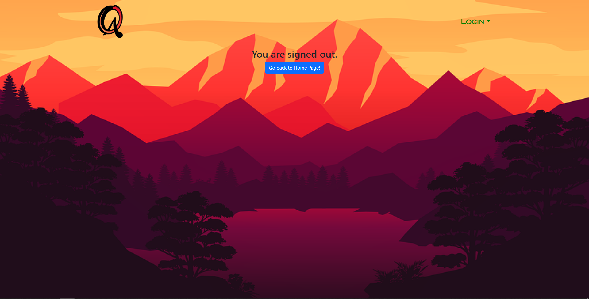

# Quizzacious

## Overview

The best way to get good at something is practice, and practice is always easier when you collaborate. Quizzacious is a program/app that allows students to make and organize quizzes and also send them to each other to help study for any subject.

## Deployment
[See our program here](http://quizzacious.xyz/ )

## User Guide
### Landing Page(Intro Page/Landing Page)
This introduction page is meant for user to act as a first landing page before any login-ins are done.
This page provides a brief description of what Quizzacious is used for along with additional information about our Milestones, our Github accounts, and the link to this page.

This page is meant to act as home page after successful authentication and/or login. 
The navbar has items available for users to interact with, such as Make-A-Quiz, Take Quiz, Profile, and dropdown button with user email will appear with signout button.

### Sign In/Register
Quizzacious allows users to enter their site credentials such as their username and password that is if they have such an account.

Allows the users to register and create a new account with the following fields email and passwords that want to use.

### Make Quiz
Users will be allowed to create their own personal quiz. This quiz will be available for everyone to take including themselves. However, it will only be editable from the user or admin. The user must first fill out the form for the title, subject, description and date. The owner field will be the user's email by default. By clicking "Create Questions" the user will be taken to a page to make questions for their quiz.

### Make Questions
Users are able to fill out the form with their question and 4 potential answers and select which answer is correct in 'Answer Final'.

### Take Quiz
This allows the users to take their own quizzes with certain fields tied to item that they created in Make-A-Quiz section. It has the following fields such as Quiz Name, Rating, and eventually a start-this-quiz.

## Quiz Page
This shows the user a brief overview of the quiz they plan on taking. It has the following fields such as Quiz Name, Rating, and 'Begin'.

### Profile
User can see their profile that they set from the registration page and it also allows users to go through other multiple tabs such as Home Page, Take a Quiz, Make a Quiz, and Your Quizzes.

### Sign Out
User can sign out from the navbar dropdown and it will also have go back to Home Page button that will take the user back to intro page.

### Admin
Allows admin-users to see quizzes and who made them from there emails which is important for following rules and guidelines of the site. Admin-users also have access to edit the quizzes or delete them with the trash button.

## Developer Guide
This section will provide detailed instructions to download, install, run, and modify this code base as a basis for their own development tasks.
### Installation
Firstly, [install Meteor](https://www.meteor.com/developers/install)

Secondly, visit the [Quizzacious github page](https://github.com/quizzacious/quizzacious) and clone the repository.

Alternatively, you can download the sources as a zip file or make a fork of the repo. However you do it, download a copy of the repo to your local computer.

Thirdly, cd into quizzacious/app and run the command `meteor npm install` in your terminal to install the libraries
Lastly, run the command `meteor npm run start` in your terminal to run the system.

If you followed the instructions correctly, the application will appear on your browser at [http://localhost:3000](http://localhost:3000)

## Development History
### M1
[Milestone 1 Project](https://github.com/orgs/quizzacious/projects/1)
### M2
[Milestone 2 Project](https://github.com/orgs/quizzacious/projects/2)
### M3
[Milestone 3 Project](https://github.com/orgs/quizzacious/projects/4)

## Contact Us
[Our Organization](https://github.com/quizzacious)
[Team Contract](https://docs.google.com/document/d/1odUst7-lIJJlnpdIlA9A50tL59SpUqIhHPayiyPgL-k/edit?usp=sharing)
